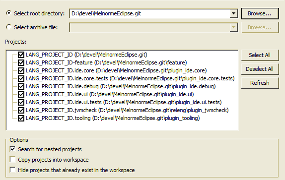
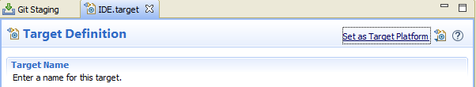

Project website: LANG_IDE_SITE

--

Developers Guide
================

#### Setting up the development environment:
 * You need [Eclipse PDE](https://eclipse.org/pde/) to develop Eclipse plugins. Download and start it.
 * Clone the Git repository.
 * In Eclipse, click "File / Import... ", and then "General / Existing projects into workspace". Select the Git repository folder as the "root directory", enable "Search for nested projects", and select all the Eclipse projects that show up. Click finish to import those projects.
<div align="center">
<a><a/> <br/>
</div>
   * Note: The actual project names will be different from those in the screenshot above.
   * Note: Java compiler settings will be automatically configured, since Eclipse compiler settings are stored in source version control.
 * Setup the target platform. Unfortunately due to limitations in Tycho/PDE tooling ([more info](https://github.com/tesla/m2eclipse-tycho/issues/29)) some manual steps are required:
   1. Open a shell on `target-platform/` and run `mvn package`. This should create a `deps-repository/repository` directory.
   1. Copy the target platform file: `target-platform/IDE-base.target` to `target-platform/IDE-gen.target`. (this last filename is already git-ignored).
   1. Open `target-platform/IDE-gen.target` in Eclipse, so that it opens under the PDE editor. 
   1. Click "Add", then select "Software Site". 
   1. On the "Add Software Site" dialog, click "Add...", then "Local...", navigate to Git repo directory, then choose the `target-platform/deps-repository/repository` directory.
   1. On the "Add Software Site" dialog, the new repository should be selected. Click "Select All" to select all deps, then click "Finish". It should look more or less like this:
<div align="center">
<a><a/> 
</div>
   1. Then finally click "Set as Target Platform".
 * Build the workspace ( "Project / Build All"). Everything should build fine now, there should be no errors.
 * To start the IDE from your workspace: Open "Run / Run Configurations ...". Click on "Eclipse Application" to create a new launch for the plugins in your workspace. The default new configuration that is created should already be ready to be launched.
 * **Additional tip:** Locate the `bin-maven` folder in the top-level project, open its Properties from the Project Explorer context menu, and mark that directory as "Derived" in the "Resources" property page. This will prevent those folder resources to appear in UI operations such as "Open Resource" for example. 

#### Running the tests in Eclipse:

#### Automated Building and Testing:
Using Maven (and Tycho), it is possible to automatically build LANG_IDE_NAME, create an update site, and run all the tests. Download [Maven](http://maven.apache.org/) (minimum version 3.0), and run the following commands on the root folder of the repository:
 * Run `mvn package` to build the LANG_IDE_NAME feature into a p2 repository (which is a local update site). It will be placed at `bin-maven/features.repository/repository`
 * Run `mvn verify` to build LANG_IDE_NAME as above and also run the test suites. You can do `mvn verify -P TestsLiteMode` to run the test suites in "Lite Mode" (skip certain long-running tests).

#### Creating and deploying a new release:
A release is a web site with an Eclipse p2 update site. The website may contain no web pages at all, rather it can be just the p2 site. To create and deploy a new release:

 1. Ensure the version numbers of all plugins/features/etc. are properly updated, if they haven't been already.
 1. Run `mvn clean verify` to perform the Tycho build (see section above). Ensure all tests pass.
   * To create a signed release the `sign-build` Maven profile must be activated, and the required properties set.
 1. Create and push a new release tag for the current release commit. 
 1. Go to the Github releases page and edit the newly present release. Add the corresponding ([ChangeLog.md](documentation/ChangeLog.md)) entries to the release notes. 
 1. Locally, run `ant -f releng/ CreateProjectSite`. This last step will prepare the project web site under `bin-maven/ProjectSite`.
 1. To actually publish the project site, run `ant -f releng/ PublishProjectSite -DreleaseTag=<tagName>`. What happens here is that the whole project site will be pushed into a Git repository, to then be served in some way (for example Github Pages). If `projectSiteGitURL` is not specified, the default value in releng-build.properties will be used.
   * For more info on the Release Engineering script, run `ant -f releng/`, this will print the help.
 1. A branch or tag named `latest` should also be created in Github, pointing to the latest release commit. The previous `latest` tag can be deleted/overwritten. The documentation pages use this tag/branch in their links.


## Project design info and notes

#### LangEclipseIDE
This project uses the LangEclipseIDE framework, which is designed to have its source embedded in the host IDE.
See [this section](https://github.com/bruno-medeiros/MelnormeEclipse/blob/master/README-MelnormeEclipse.md#understanding-melnormeeclipse-source-embedding) for more info on how this should be managed.

### Extensive Compile-Time type and contract checking
See https://github.com/bruno-medeiros/MelnormeEclipse/wiki/Extensive-Compile-Time-Checking for more info on this principle.

### Code style:
 * Indent with tabs (tab size is 4 spaces)
 * Max line width: 120
 * Block style:
```
    if(foo.blah()) {
        doThis();
    }
```
 * Indentation for function arguments: 1 indent unit (= 1 tab):
```
    foo(one, two, three,
        four, five, six);
```

There is also an [Eclipse formatter profile settings file](code-style.xml) you can use, although you are not obliged to format with all rules of that formatter settings. If you make a minor source change, don't format the whole file, but only around the changes you are contributing.

#### Unit tests double-method wrapper:
 
This code idiom is often used in this project's JUnit tests:
```java
@Test
public void testXXX() throws Exception { testXXX$(); }
public void testXXX$() throws Exception {
```
This is donely solely as an aid when debugging code, so that the "Drop to frame" functionality can be used on the unit-test method. It seems the Eclipse debugger (or the JVM) cannot drop-to-frame to a method that is invoked dynamically (such as the unit-test method). So we wrap the unit-test method on another one. So while we now cannot drop-to-frame in `testXXX`, we can do it in `testXXX$`, which basically allows us to restart the unit-test.

TODO: investigate if there is an alternate way to achieve the same. I haven't actually checked that.
