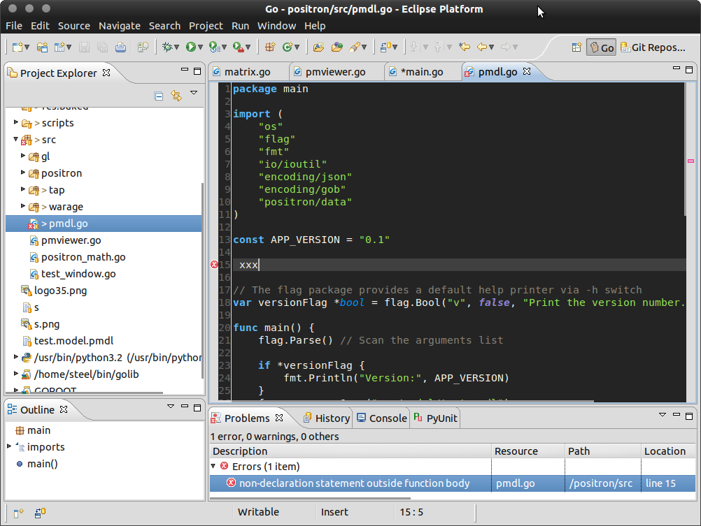

### Features
- Configurable syntax highlighting
- Autocompletion via Gocode
- Shows documentation via autocompletion popups
- Error reporting within Eclipse
- Automatic building of command files and packages
- Debug support with the GDB debugger (based on CDT).
- GOPATH integration

### Screenshot:

<a><a/> 

