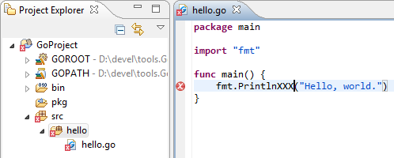
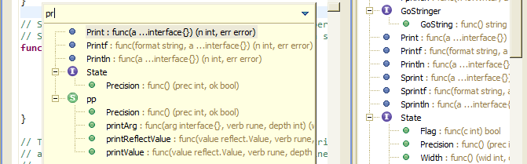
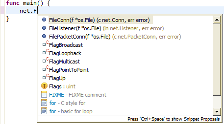
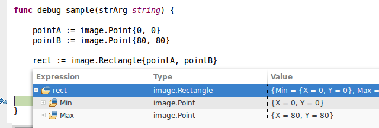

### Features:

 * Go source code editor, with:
   * Syntax highlighting (configurable). 
   * Automatic indent/de-indent and brace completion on certain keypresses (Enter, Backspace).
 * Go Project wizard and project builder.
   * With in-editor build errors reporting.

|  `Editor and workbench screenshot` |
|----|

   * Editor outline and Quick-Outline (`Ctrl+O`).
   
|  `Editor and workbench screenshot` |
|----|

 * Open Definition (and "Ctrl-click") via [Go oracle](http://golang.org/s/oracle-user-manual).
 * Content Assist (auto-complete) via [gocode](https://github.com/nsf/gocode). 
  * Content Assist code snippets (configurable).

|  `Content Assist screenshot` |
|----| 

#### Debugging functionality. 
Fully featured GDB debugger support (reusing Eclipse CDT's GDB integration)
  * Stop/resume program execution. Listing program threads and stack frame contents.
  * Setting breakpoints, watchpoints (breakpoint on data/variables), tracepoints. Breakpoint conditions.
  * Stack variables inspection view. Expression watch and view. Disassembly view.
  * Non-stop mode (for supported GBDs). Reverse debugging (for supported GDB targets).

|  `Execution stopped on a breakpoint` |
|----|
