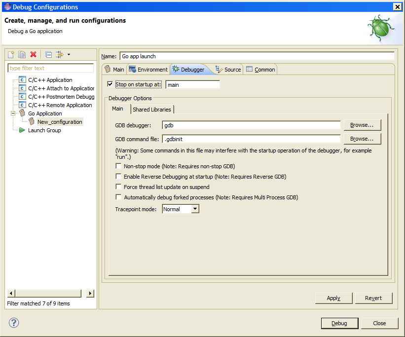

## User Guide

*Note:* For an overview of Goclipse features, see [Features](Features.md#ddt-features). This also serves to document 
what overall functionalities are available.

### Eclipse basics

If you are new to Eclipse, you can learn some of the basics of the Eclipse IDE with this short intro article: 
[An introduction to Eclipse for Visual Studio users
](http://www.ibm.com/developerworks/opensource/library/os-eclipse-visualstudio/)

Also, to improve Eclipse performance and startup time, it is recommended you tweak the JVM parameters. There is a tool called Eclipse Optimizer that can do that automatically, it is recommended you use it. Read more about it [here](http://www.infoq.com/news/2015/03/eclipse-optimizer). (Installing/enabling the JRebel optimization is not necessary as that only applies to Java developers)

### Configuration

A [Go installation](https://golang.org/doc/install) is required for most IDE functionality. Access Eclipse preferences from the menu `Window / Preferences`, navigate to the `Go` preference page, and configure the Go installation path under the `GOROOT` field. 

For functionality such as code completion, open definition, and editor outline, you will need:
 * The [gocode](https://github.com/nsf/gocode) tool. It is recommended to use the latest gocode version.
 * The [Go Oracle](http://golang.org/s/oracle-user-manual) tool. 
 
The path to the executable of these two tools should be configured in the `Go / Tools` preference page. The path can be an absolute path, or just the executable name, in which case, the executable will be searched in the PATH environment variable.

### Project setup

##### Project creation:
A new Go project is created with the New Project Wizard: from the Project Explorer context menu, select `New / Project...` and then `Go / Go Project`. The same wizard can be used to add a pre-existing project: simply use the location field to select a pre-existing directory.

##### Project structure: 
A Goclipse project can work in two ways:
 * The project location is a subfolder of the 'src' folder of some GOPATH entry. The project will then consist of the Go source packages contained there.
 * The project location is not part of any GOPATH entry. In this case the project location will implicitly be added as an entry to the GOPATH, and a Go workspace structure with the `bin`, `pkg`, and `src` directories will be used in the project. Note that the project's implicit GOPATH entry will only apply to the source modules in that project. It will not be visible to other Goclipse projects (unless the entry is explicitly added to the global GOPATH).

 > In the `src` folder you can create Go source files that will be compiled into a library package (and placed into `pkg`), or into an executable (and placed in `bin`). See http://golang.org/doc/code.html for more information on the organization of a Go workspace.

##### Building:
A project has a set of Build Targets, each being a command invocation that builds the source code into one or more artifacts, and reports back possible compilation errors to the IDE. Build Targets can be configured directly from the Project Explorer. 

Build Targets can be enabled for a regular project build, or for auto-check. Auto-check is invoked when an editor is saved and no syntax errors are present in the source code. Normally it does not produce any artifacts, it just checks for compilation errors. **Note that auto-check is a different setting than the Eclipse workspace "Project / Build Automatically" option**. LANG_IDE_NAME ignores the later option by default. Auto-check is also not invoked if a file is saved automatically due to a regular build being requested. 

From the context menu of a Build Target, you can also directly create a Run or Debug launch configuration for one the generated executables. 

Each Go project has 3 built-in Build Targets:
 * `build`: The default build. Builds all Go packages present in the project (excluding test packages).
 * `build-tests`: Builds all Go test packages present in the project. 
 * `[run-tests]`: Builds all and *runs* Go tests.

### Editor and Navigation

##### Editor newline auto-indentation:
The editor will auto-indent new lines after an Enter is pressed. Pressing Backspace with the cursor after the indent characters in the start of the line will delete the indent and preceding newline, thus joining the rest of the line with the previous line. Pressing Delete before a newline will have an identical effect.
This is unlike most source editors - if instead you want to just remove one level of indent (or delete the preceding Tab), press Shift-Tab. 

##### Code-Completion/Auto-Complete:
Invoked with Ctrl-Space. This functionality is called Content Assist in Eclipse. 

> This functionality is provided by the [gocode](https://github.com/nsf/gocode) tool. If there is a problem with this operation, a diagnostics log with the output of gocode can be seen in the `Go Tools Log` console page in the Eclipse Console view.

##### Open Definition:
The Open Definition functionality is invoked by pressing F3 in the source editor. 
Open Definition is also available in the editor context menu and by means of editor *hyper-linking* 
(hold Ctrl and click on a reference with the mouse cursor). 

> This functionality is provided by the [Go Oracle](http://golang.org/s/oracle-user-manual) tool. If there is a problem with this operation, a diagnostics log with the output of oracle can be seen in the `Go Tools Log` console page in the Eclipse Console view.

### Launch and Debug:
To run a Go project that builds to an executable, you will need to create a launch configuration. Locate the main menu, open `Run / Run Configurations...`. Then double click `Go Application` to create a new launch, and configure it accordingly. You can run these launches from the `Run Configurations...`, or for quicker access, from the Launch button in the Eclipse toolbar. You will need to specify a Go package as the build target for the launch.

Alternatively, you can start a launch by selecting a Go package folder in the Project Explorer, opening the context menu, and selecting `Run As... / Go Application`. (or `Debug As...` for debugging instead). If a matching launch configuration exists already, that one will be run.

##### Debugging

| **Windows note:** _Using Cygwin GDB doesn't work very well, if at all. The recommended way to debug in Windows is to use the GDB of [mingw-w64](http://mingw-w64.org/), or the one of [TDM-GCC](http://tdm-gcc.tdragon.net/)._ |
|----|

| **Windows Note:** _Even with the above, the Go toolchain does not seem to fully support debugging in Windows. While setting breakpoints and step/continue seems to work, inspecting variables doesn't work - garbage values are displayed._ |
|----|

| **OS X note:** _The GDB that is included with OS X doesn't work properly. You'll need to install the latest GDB from Homebrew. See [this article](http://ntraft.com/installing-gdb-on-os-x-mavericks/) for details._ |
|----|

You can debug a Go program by running a launch in debug mode. You will need a GDB debugger. To configure debug options (in particular, the path to the debugger to use), open the launch under 'Run' / 'Debug Configurations...', and then navigate to the 'Debugger' tab in the desired launch configuration:

<a href="screenshots/UserGuide_DebuggerLaunchConfiguration.png?raw=true"><a/> 

GDB debugger integration is achieved by using the CDT plugins. To configure global debugger options, go the 'C/C++'/'Debug'/'GDB' preference page.

**Note that for debugging to work**, the program must be compiled with debug symbols information, and those debug symbols must be on a format that GDB understands (DWARF3). Otherwise you will get GDB error messages such "(no debugging symbols found)" or "file format not recognized". 

With Go, debugging information is already added by default when compiling, but certain inline optimizations might confuse the debugger. To disable the, use them `-gcflags "-N -l"` flags. For more info see: http://golang.org/doc/gdb.

