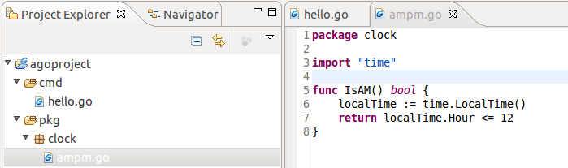

## User Guide

### Eclipse basics

If you are new to Eclipse, you can learn some of the basics of the Eclipse IDE with this short intro article: 

[An introduction to Eclipse for Visual Studio users
](http://www.ibm.com/developerworks/opensource/library/os-eclipse-visualstudio/)

Also, to improve Eclipse performance on modern machines, it is recommended you increase the memory available to 
the JVM. You can do so by modifying the _`eclipse.ini`_ file in your Eclipse installation. The two VM parameters 
in _`eclipse.ini`_ to note are _-Xms_ (initial Java heap size) and _-Xmx_ (maximum Java heap size). For a machine
with 4Gb of RAM or more, the following is recommended as minimum values:

```
-vmargs
-Xms256m
-Xmx1024m
```

### Goclipse Prerequisites and Configuration

Open Eclipse preferences, go to the Go preference page, and configure the GOROOT, GOPATH settings appropriately. You will need an installation of the Gocode tools.

### Project setup

##### Project creation:
A new Go project can be created in the Project Explorer view. Open `New / Project...` and then `Go / Go Project`. The Go perspective should open after creation, if it's not open already.

##### Project structure: 
TODO this sections needs updating

Once the project is set up, its file structure should look like this, with two locations for source code, `src/pkg` and `src/cmd`. The wizard will also create two folders for output of the build process `bin/<goos>_<goarch>`, and `pkg/<goos>_<goarch>`. 

Any files located in this 'cmd' folder will be compiled and linked into an executable of the same base name as the file (in this case, hello or hello.exe), and placed into the 'bin' output folder tree. 

###### Local packages

That's all great if you want all of your code to live in one main file. However, if your code base grows beyond a few lines, separating out packages of related functionality becomes useful.

The Go tools typically assume that all packages will be installed into the standard Go library space (that is under the `$GOROOT/pkg` folder). GoClipse supports the concept of a "local" package that is only available to code within a project (or eventually within any projects that depend on it).

To construct such a local package, create a subfolder of the `pkg` folder in the Project Explorer, called `clock`. Add a file to the subfolder called `ampm.go` and add the following content: 

<div align="center">
<a><a/> 
</div>

You may now reference this package `clock` and its one function, `IsAM()` within your main code.

###### Additional tips

 * Subfolders of `cmd` will be compiled and linked into executables based on the name of the subfolder
 * Files named *_test.go and _testmain.go are currently ignored for compatibility with other tools 

###### New Build Rules for 0.7.2

 * Any main package files under a folder named 'src' or 'cmd' will not build as a group into a single executable. Each file will build individually into an executable whose name is given by the name of the file from which it originated.
 * Main package files contained in folders not named 'src' or 'cmd' will build as a group into a single executable. The target executable is given the same name as the folder that contained the originating files. Additionally, only one file in a folder can contain a main function and all files must share a common package name. Thus, you cannot mix main package files with other package files. 


##### Build configuration:
TODO more info

Note that if the `Project / Build Automatically` option in the main menu is enabled (the default), a workspace build will be requested whenever any file is saved. Turn this on or off as desired.

### Editor and Navigation

##### Editor newline auto-indentation:
The editor will auto-indent new lines after an Enter is pressed. Pressing Backspace with the cursor after the indent characters in the start of the line will delete the indent and preceding newline, thus joining the rest of the line with the previous line. Pressing Delete before a newline will have an identical effect.
This is unlike most source editors - if instead you want to just remove one level of indent (or delete the preceding Tab), press Shift-Tab. 

##### Code-Completion/Auto-Complete:
Invoked with Ctrl-Space. This functionality is generally called Content Assist in Eclipse. 

Code completion is provided by means of the gocode tool (http://github.com/nsf/gocode). The gocode tool is bundled with GoClipse. But if want you can use your own gocode instance, by configuring its location in the `Go / Gocode` preference page.

### Launch and Debug:
To run a Go project that builds to an executable, you will need to create a launch configuration. Locate the main menu, open 'Run' / 'Run Configurations...'. Then double click 'Go Application" to create a new launch, and configure it accordingly. You can run these launches from the 'Run Configurations...', or for quicker access, from the Launch button in the Eclipse toolbar.

Alternatively, to automatically create and run a launch configuration, you can select a Go project in the workspace explorer, open the context menu, and do 'Run As...' / 'Go Application'. (or 'Debug As...' for debugging instead). If a matching configuration exists already, that one will be run.

Whenever a launch is requested, a build will be performed beforehand. This behavior can be configured under general Eclipse settings, or in the launch configuration.

##### Debugging
You can debug a Go program by running a launch in debug mode. You will need a GDB debugger. To configure debug options (in particular, the path to the debugger to use), open the launch under 'Run' / 'Debug Configurations...', and then navigate to the 'Debugger' tab in the desired launch configuration:

<div align="center">
<a><a/> 
</div>

GDB debugger integration is achieved by using the CDT plugins. To configure global debugger options, go the 'C/C++'/'Debug'/'GDB' preference page.

**Note that for debugging to work**, the program must be compiled with debug symbols information, and those debug symbols must be on a format that GDB understands. Otherwise you will get GDB error messages such "(no debugging symbols found)" or "file format not recognized". 

TODO: info on Go optimizations that affect debugging
